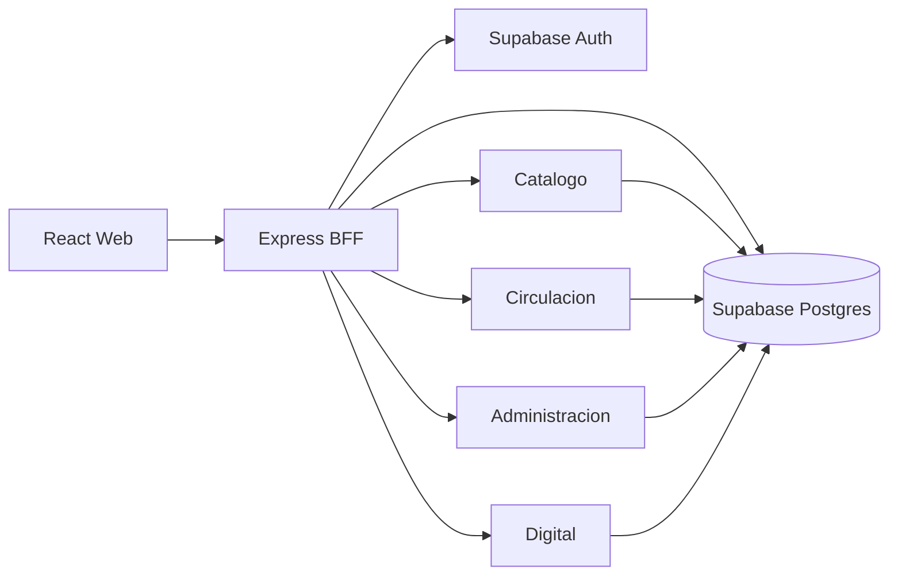

# Fase 2 - Diseno y arquitectura

## Modulos definidos

1. `web`
- Portal React para usuarios y personal de biblioteca.
- Secciones de catalogo, circulacion, recursos digitales y administracion.
- Componentes separados para RBAC y operacion bibliotecaria.

2. `server`
- API BFF de negocio en Express.
- Rutas principales: auth, catalog, circulation, digital y admin.
- Valida payloads con Zod, aplica permisos RBAC y registra auditoria.

3. `supabase`
- Auth para sesiones.
- Postgres para datos de biblioteca.
- RLS como defensa de acceso por usuario y staff.
- Migraciones para catalogo, circulacion, RBAC y campos bibliograficos extendidos.

## Diseno de base de datos

Entidades principales:

- `profiles`, `roles`, `permissions`, `user_roles`, `role_permissions`.
- `materials`, `material_contributors`, `tags`, `material_tags`, `material_relations`.
- `material_copies`, `digital_assets`, `inventory_items`.
- `loans`, `reservations`, `fines`.
- `acquisition_requests`, `interlibrary_requests`, `notifications`.
- `audit_logs`, `analytics_snapshots`.

## Reglas de negocio

- Los roles ADMIN y BIBLIOTECARIO tienen operacion administrativa.
- Usuarios finales consultan catalogo, reservas, prestamos propios, renovaciones propias y multas propias.
- Los prestamos fisicos requieren una copia disponible que pertenezca al material seleccionado.
- Las devoluciones liberan la copia y generan multa si existe retraso.
- Las reservas respetan limite por usuario y bloqueos temporales.
- Las eliminaciones de materiales son bajas logicas mediante estado `archived`.

## Diagrama de arquitectura

## Seguridad y auditoria

- Las rutas protegidas requieren Bearer token.
- Los permisos efectivos se derivan de roles almacenados en Supabase.
- Acciones sensibles registran `audit_logs`.
- No se usan datos editables de usuario para autorizacion.
